# Virtual Assistant Referee
##### Player contact and foul detection in sports using AI based video analysis.
This app is deployed at : [https://virtual-assistant-referee.streamlit.app/](https://virtual-assistant-referee.streamlit.app/)

## Run

Package Requirements: `TensorFlow`,`OpenCV`,`Numpy`,`Streamlit`

To run the project:

```bash
git clone "https://github.com/harshpx/Virtual-Assistant-Referee.git"

cd Virtual-Assistant-Referee

python3 -m venv venv
or
python3.11 -m venv venv

source ./venv/bin/activate

pip install -r requirements.txt

streamlit run app.py
```
## Project Description
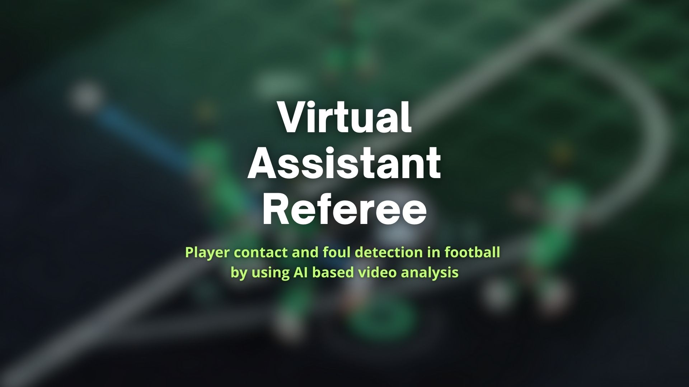
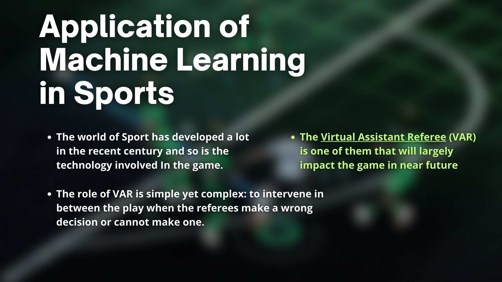
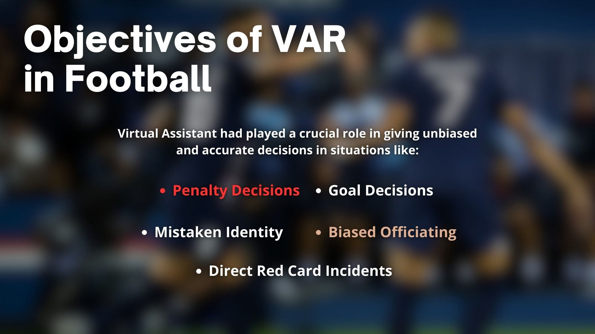
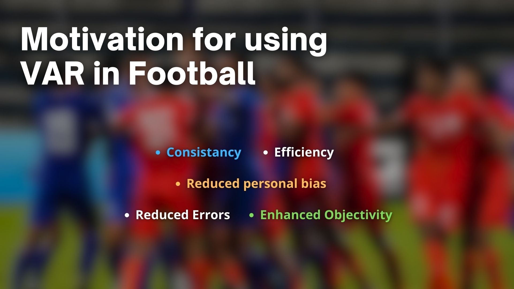
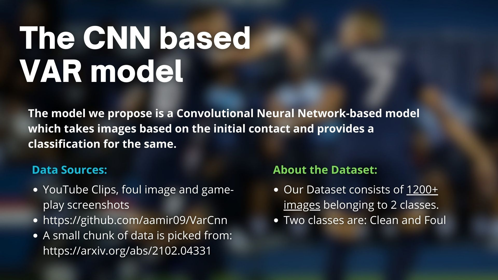
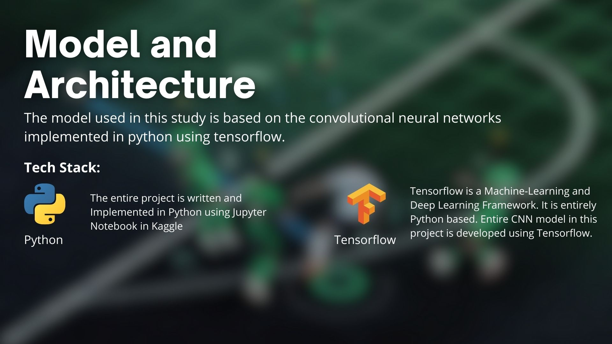
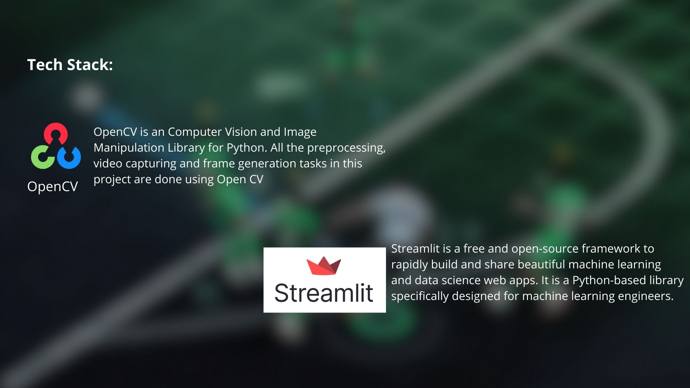
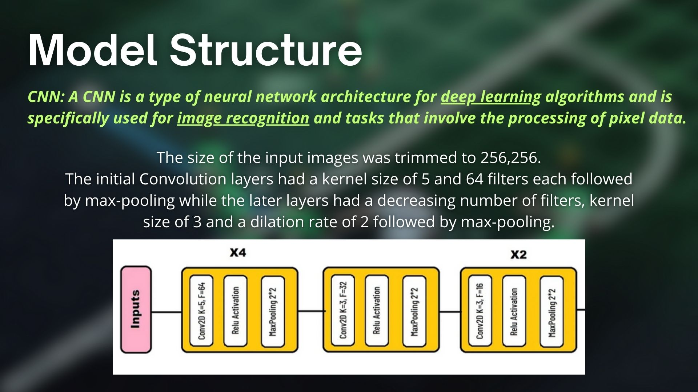
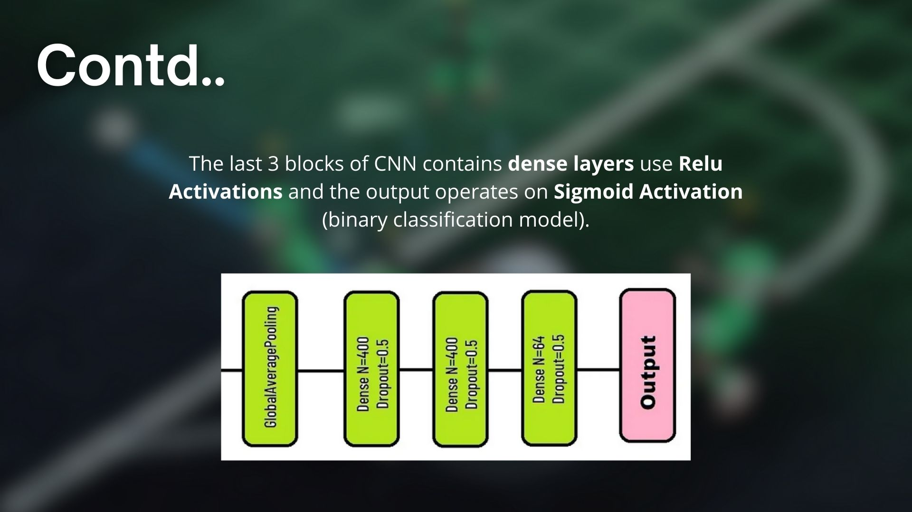
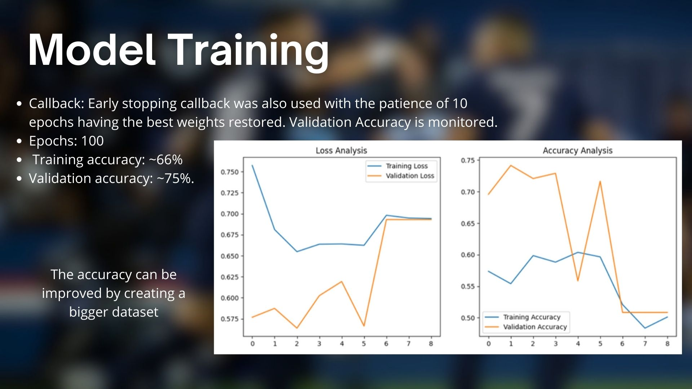
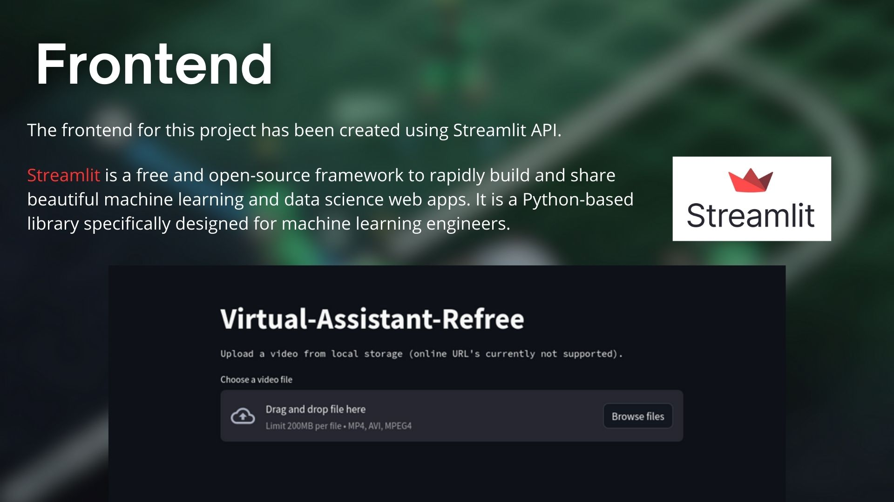
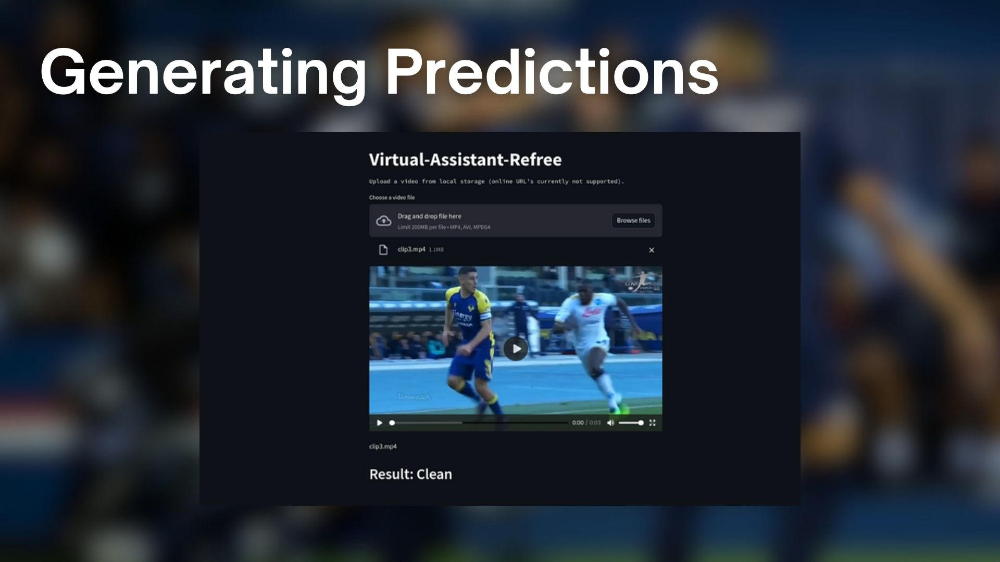

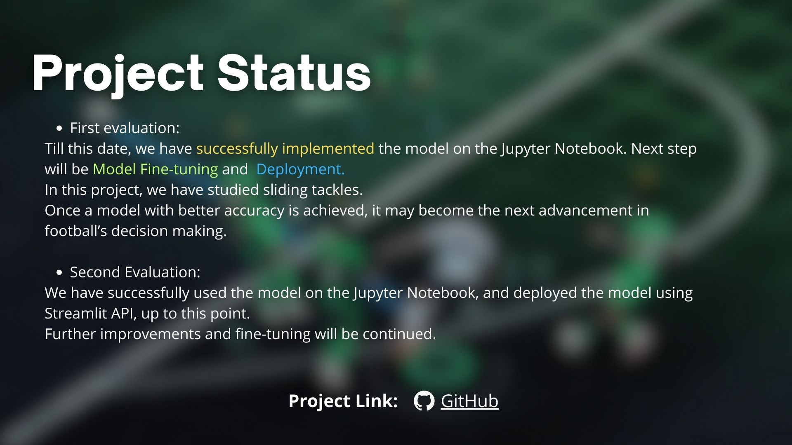
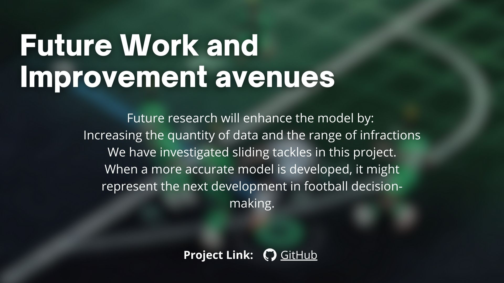
